# 百工谱——AIGC物品展示框
## Artisan's Tome

「一物一世界，一触一春秋」

[toc]

## 项目简介
一款基于ESP32的智能桌面艺术装置。

## 项目功能
基于预设库中时代、地域、职业等元素与文化符号，通过图像生成模型，创造出一件独一无二的虚拟物品，在电子墨水屏上呈现独特的视觉体验，让每一次交互都成为在历史长河中的一次随机发现，让科技与人文在方寸之间完美交融。

## 开源链接
https://oshwhub.com/ljh345/artisans_tome

## 视频链接
https://www.bilibili.com/video/BV11pWbzYEnt

## 使用说明
注册API可参考https://www.bilibili.com/video/BV1PW4VzbEP8。
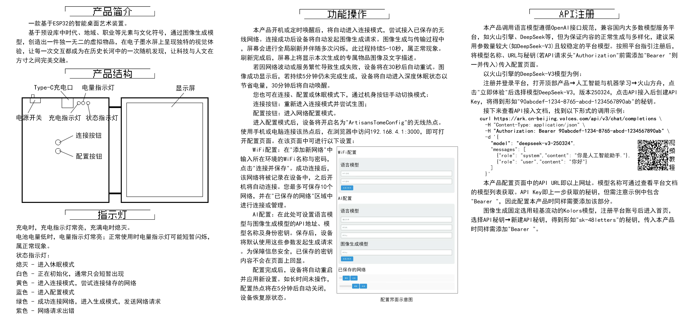

## 应用、推广与展望
目前项目的生成内容涵盖多个时代、职业与地域文化，提供丰富、多样化的探索体验。
对于特定领域的展示需求，如文旅、艺术、科教等，可进一步优化：
1. 在限定领域内，将Prompt更加具体化和专业化，如明确指定某个城市/景区或历史人物，生成与之相关的专属物品，作为当地的专属文创。
必要时，可考虑模型微调、知识库等技术，提供更专业、精准的生成效果。
2. 可根据需要调整输出的语言风格，如更侧重于历史文化知识，提升内容的教育属性与价值。
3. 添加更多交互功能，如通过物理触发（如摇动设备）来生成新内容；支持保存下载物品图片；添加热敏打印模块，将生成的内容实体化；支持短对话语音识别，并将识别内容与随机设定进行融合。
4. 换用更稳定的生图API。

## 结构设计
本项目使用FreeCAD进行设计。
外壳目前设计为书本形，本部分称两侧为"屏幕页"与"电路页"。
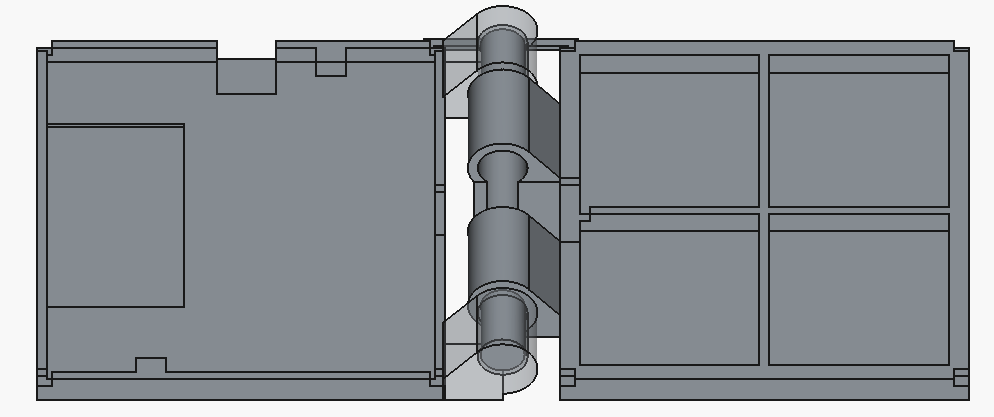
屏幕与PCB均固定在对应页的外壳之间，因此每页包括上下两部分，且通过四角的方凸台/槽配定位（该设计不能紧密配合，需要在缝隙涂抹热熔胶固定）。
两下页连接使用铰链，两下页与铰链可一体成型$^{[1]}$。由于铰链为转动配合，两部件实际上分离，因此对于检测多壳体结构的打印平台，需要在两下页添加易去除的薄连接桥，使平台认定为一个整体。
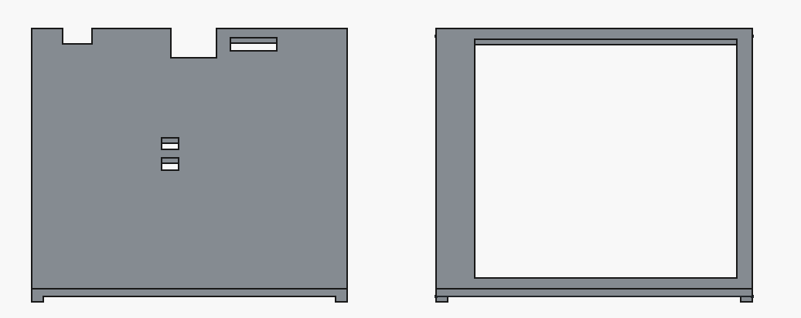
实际按键并未采用原理图上的封装，而是选择4.5\*4.5\*3.5的直插按钮横放，因此电路上页按键孔位置与原理图不符，若更换按钮需要额外调整。

## 硬件设计
### PCB设计
PCB厚度选用0.8mm。
推荐在目前基础上进行以下修改：PCB边缘刚好与外壳边缘投影后重合（即添加图中阴影部分），同时Type-C接口与开关向外移。
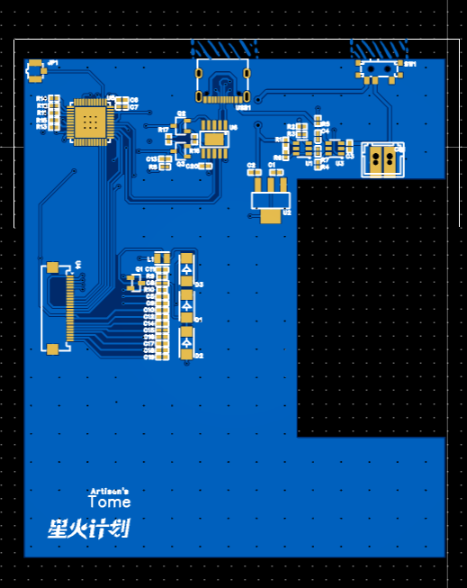

### 电源电路

本设备采用3.7V锂电池供电，经线性稳压器BL9110-330BPFB输出3.3V，参考前作$^{[2]}$。*后续可改为DC-DC降压电路，提高电源效率。*
电源电压检测采用CN312，其内部主要包括电压比较器与基准电压源。简而言之，RTH引脚电压高于内部基准电压（1.205V）时LBO输出低电平，FTH低于基准电压时LBO输出高电平，LBO#引脚电平相反。方便起见，设置基准电压为3.605V，且FTH与RTH电压相等，则电源电压低于3.605V时LED亮起，反之熄灭。

### 主控电路
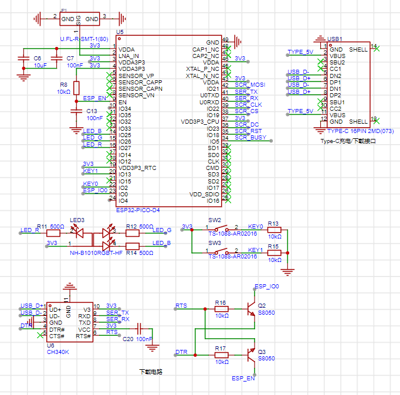
整体设计参考前作$^{[2]}$，其中由于按钮需要实现深度休眠唤醒功能，因此按钮连接在RTC GPIO（0, 2, 4, 5, 12, 13, 14, 15, 25, 26, 27, 32, 33, 34, 35, 36, 37, 38, 39）上，且需注意对应芯片内部自带的上下拉电阻。
与墨水屏连接（前缀SCR）的引脚建议改为SCK-18, MOSI-23, MISO-19, CS-5（对应硬件SPI），或顺序反向便于走线。

### 墨水屏驱动
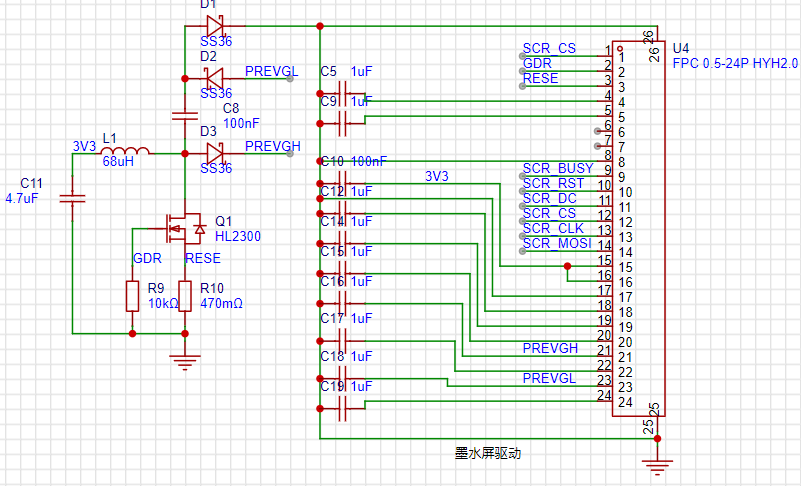
按照$^{[3-4]}$进行设计，其中NMOS、肖特基二极管可自行替换。

## 嵌入式软件
### 网络连接、存储与配网
本项目支持WiFi连接与配网。
ESP32提供的Preferences库利用芯片内置的NVS，实现了数据的断电保留，可用于记录连接过的WiFi信息，实现自动连接。
设备每次成功连接后，记录WiFi的SSID与密码，在下次启动时将依次尝试连接所有记录的网络，直到成功或连接超时。
配网模式下，设备工作在AP模式，并维护一个HTTP服务器（页面使用html编写，储存在char*变量中）。用户连接ESP32的WiFi后，通过浏览器访问设置的固定地址```192.168.4.1:3000```，即可进入配网页面。用户输入WiFi的SSID与密码后，点击提交按钮，设备将尝试连接该WiFi，若成功则自动重启，并保存输入的表单内容。

### 休眠与唤醒
为保证设备在常开情况下能够长时间工作，在不需要生成图像时ESP32处于深度休眠状态，此时除RTC、ULP协处理器等外设几乎全部关闭，电流可降低到uA级别$^{[5]}$。
休眠后，可通过RTC GPIO唤醒，或通过RTC定时器唤醒，本项目中两方式均采用。
具体地，```esp_sleep_enable_timer_wakeup(us)```可配置设备在指定时间后自动唤醒，而```esp_sleep_enable_ext1_wakeup(pins, mode)```用于指定GPIO唤醒的引脚与模式（电平或边沿等），并在```esp_deep_sleep_start()```执行后进入休眠状态。
唤醒后```esp_sleep_get_wakeup_cause()```可获取唤醒原因，用于执行不同的操作。

### 网页访问
此部分参见$^{[2]}$ 软件设计-路径规划-搭建远程平台。
注意，此处设置函数执行时长上限为30s，因此函数有概率执行失败。
具体失败时间段未确定，但多在晚上到次日白天，且目前确定与账号用量**无关**，推测是硅基流动服务器使用高峰期，导致生成速度降低，一次完整函数流程用时显著增加。

### 墨水屏显示
项目采用汉硕WFH0420CZ35墨水屏，驱动程序可完全参考WaveShare 4.2inch e-Paper Module (B)$^{[6]}$，使用SPI接口进行通信，本项目使用GPIO模拟SPI时序。
本项目屏幕尺寸为400\*300，若仅使用黑色显示，则图片所需字节为400\*300/8=15000，在ESP32 Pico-D4中具有足够内存空间。
显示逻辑如下：
墨水屏为红黑白三色，因此需要将图片分为黑色、红色两部分。以黑色为例，每一位分别控制一个像素点（低电平为墨水显示），黑色会被红色覆盖。从左上角开始，15000字节依次对应从上到下、从左到右的像素点，低位在左。完成数据发送后，需向墨水屏发送全局刷新指令，更新图像。
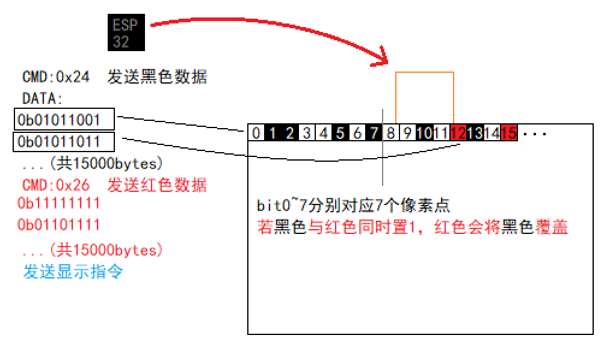
若换用其他型号墨水屏，驱动程序需自行修改，但接口与代码框架大体类似。

## 图像生成与处理
### 运行平台与环境
图像生成与处理均在华为云FunctionGraph上运行$^{[2]}$。由于华为云的免费APIG服务已停止，但先前申请的APIG仍可使用，因此所有设备均调用已部署的API，传入用户自行配置的AI Token。
也可自己搭建服务器或使用类似服务，此时需要修改ESP32中的URL。

### Prompt设计
使用DeepSeek大语言模型的目的是，获取一段可用于生图的Prompt。Prompt采用**循序渐进**的方式，先根据职业生成人物设定，再根据设定生成物品，最后根据生成生图Prompt与物品描述，且严格限制输出格式以便读取。
随机元素包括人物设定（如年龄、职业类别）、背景设定（时代、语言风格）及生成设定（如物品来源），若完全通过AI生成会导致内容趋于同质化，因此直接在代码内**随机**产生，在下方通过[]标出：
（该Prompt在后续可能会更新）

```
你是一位来自[时代，如"唐代"]中国，[12~70]岁的[男/女]性，
从事[职业类型，如"农业/种植类"]职业，来自[地区，如"岭南"]
请根据以下约束生成内容：
role：你的具体职业（具体而简短），该职业类型属于[以上职业类型]
item：[三选一]（8字以内，不要带括号），
该场景下参考物品品质：草帽5/酒30/铁锄50/米10/绢200/牛1500，该物品品质为[1~10000]

description：一段描述性文字，涉及其特征、功能、来历、故事等，不使用第一人称
- 长度：保证在60字符以上、75字符以下（计算标点）
- 语言风格：[符合时代特点的详细风格，如"五言或七言唐诗体裁，如李白、李贺的诗歌，
自信奔放，意境开阔，色彩浓烈，充满奇特的想象和磅礴气势。"]
- 不要带有emoji

prompt：用于文生图的提示词
- 必须包含：物品材质+形态+颜色+细节特征，白色背景
- 禁止出现：拼接碎片、透视变形
- 需描述物品形态、材质、颜色、典型特征等
- 描述物品时语言需简洁而准确，不要出现歧义，物品名称可适当换成便于文生图理解的描述

严格按照以下示例输出json：
{
"role":string
"item": string
"description": string
"prompt"：string
}
```
其中，item的"三选一"可能为如下内容：
```
生成一项与你的职业特征强相关的[工具/原料/产品/装备/职业标志]
生成一项与你的职业弱相关或无关，但你可能会携带或使用的["物品",或物品类型,如"容器""生活用品"]
生成一项你从[父母/朋友/邻居/(子女/配偶/长辈, 根据年龄)]获得的["物品"或物品类型]
```
返回示例如下：
```
{
    'role': '风水罗盘匠', 
    'item': '铜制风水盘', 
    'prompt': '3D建模参考图，白色背景，等距视角，写实风格，铜制圆盘
    表面氧化泛青，中央太极阴阳鱼浮雕，外圈镌刻天干地支篆文，边缘有磨
    损包浆', 
    'description': '祖传三代的黄铜罗盘，指针永远指向东南'
}
```
获取的Prompt用于图像生成，并向生图模型传入Base64形式的以下参考图像以统一风格：


### API调用与接口设计
为提高设备对不同AI的兼容性，以便在AI推陈出新时用户可选择更好的模型，同时避免多设备使用相同API导致短时间用量达到上限，本项目允许用户自定义API的URL与模型名称。
选用的大语言模型需采用**OpenAI形式**接口，以火山引擎的豆包为例，`POST`请求格式如下：
```
curl https://ark.cn-beijing.volces.com/api/v3/chat/completions \
  -H "Content-Type: application/json" \
  -H "Authorization: Bearer $ARK_API_KEY" \
  -d '{
    "model": "doubao-1-5-pro-32k-250115",
    "messages": [
        {
            "role": "system",
            "content": "You are a helpful assistant."
        },
        {
            "role": "user",
            "content": "Hello!"
        }
    ],
    "stream": false
  }'
```
其中，请求头的`Authorization`字段为API密钥，`model`字段为模型名称，与URL需作为访问FunctionGraph时的`POST`请求体参数传入。`stream`流式输出为false，若部分API默认为true则需显式指定为false。
对于图像生成，各API的功能、接口存在差异，且此项目需要用到参考图像功能，因此固定采用硅基流动的`Kolors`模型（**免费**且每天可生成400张图像），仅需将API密钥传入即可。
在FunctionGraph中，提供的参数会被解析，并在调用API时相应传入。

### 图像处理
为使彩色图像在黑白屏幕显示，需要将图像转为灰度图，并将尺寸缩小到300\*300（原图为1:1）。此后对图片进行随机抖动处理：
设像素点的灰度值为$g\in[0,1]$，则转换后灰度值为$h=g>rand()\hspace{2px}?\hspace{2px}1\hspace{2px}:\hspace{2px}0$，其中$rand()$服从$[0,1]$上的均匀分布。
完成后，在图像上添加文字，包括物品名称、拥有者职业与物品描述，字体采用Zpix。完整图像将进行旋转以适应屏幕方向，编码为15000字节的文件，对应墨水屏驱动时依次传递的120000像素（仅黑色）。
示例如下：
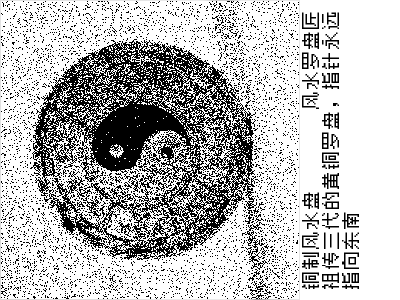

### 存储与下载
文件上传至阿里云对象存储（OSS）指定路径中（`"a.img"`）。若用户自行使用更大的显示屏，可将内容分为多个小文件，ESP32多次调用OSS下载URL分别下载，或探索其他方法。
~~由于FunctionGraph试图导入阿里云SDK oss2没成功，~~ 直接访问Bucket对应的URL进行上传，此时需要手动构建签名信息。
在名为`bucket_name`的Bucket中创建路径为`path`的文件，即使用`POST`方法访问`https://{bucket_name}.{endpoint}/{path}`，则请求头需满足以下形式：
```python
headers = {
        'Authorization': f'OSS {access_key_id}:{signature}',
        'Date': date_str,  # 类似Tue, 30 Sep 2025 02:58:16 GMT
        'Content-Type': content_type
    }
```
`signature`通过以下形式构建：
```python
    bucket_name = 'your_bucket_name'
    endpoint = 'your_endpoint'  # 如oss-cn-shenzhen.aliyuncs.com
    method = 'PUT'
    content_type = 'application/octet-stream'  # 二进制文件
    date_str = email.utils.formatdate(usegmt=True)
    access_key_id = str(os.getenv('OSS_ACCESS_KEY_ID'))
    access_key_key = str(os.getenv('OSS_ACCESS_KEY_SECRET'))
    canonicalized_oss_headers = ''

    canonicalized_resource = f'/{bucket_name}/{path}'
    string_to_sign = f"{method}\n\n{content_type}\n{date_str}\n{canonicalized_oss_headers}{canonicalized_resource}"
    h = hmac.new(
        access_key_key.encode('utf-8'), 
        string_to_sign.encode('utf-8'), 
        hashlib.sha1
    )
    signature = base64.b64encode(h.digest()).strip().decode('utf-8')
```
`OSS_ACCESS_KEY_ID`与`OSS_ACCESS_KEY_SECRET`为阿里云OSS的Access Key ID与Access Key Secret，可在阿里云控制台获取：
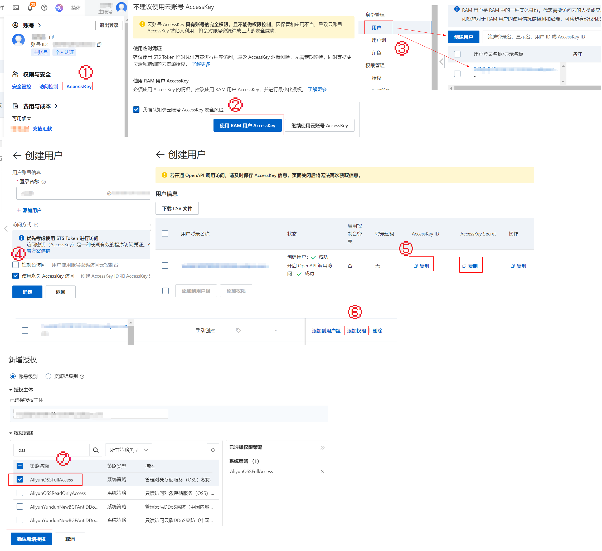
**注意：以上方式获取Access Key时，关闭第⑤步的页面后将无法再次查看！**
完成步骤后，将其配置在FunctionGraph的环境变量中，**不要使用加密参数**。
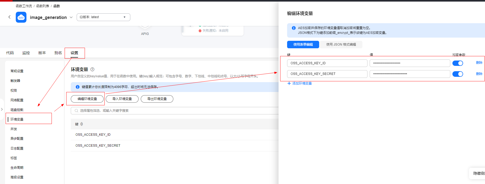

由于Bucket权限设置为公共读，因此可直接在ESP32`GET`访问`https://{bucket_name}.{endpoint}/{path}`获取图片。云端通过向下位机发送生成成功信息（`status=0`）后提示下载。

## 功耗测试
功耗为粗测：在电池正极串联800mΩ电阻，测量电阻两端电压如下。
测量示波器无保存图像功能，因此下图为多次截图后使用透视校正拼接得到；电压计算采用近似处理；每次运行时，连接网络、调用API时间均不同。
横坐标一格为1s，纵坐标一格为100mV。
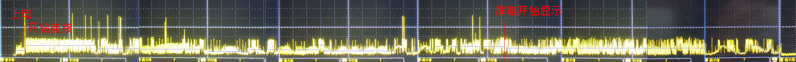
曲线与横轴包围面积为36.474格，即单次功耗为4.559As=1.266mAh。
休眠时ESP32电流可低至20uA，因此忽略不计。
若使用500mAh电池，不关闭设备（一天请求48次），充满电可使用约8.22天。

（正在添加夜间休眠功能中，延长一次充电使用寿命）

## BOM表与费用
### 制作成本
**以下部分元件立创商城与其它途径相差较大，在`Supplier`一栏中未写`LCSC`则为其它途径价格。**
| No. | Quantity | Comment               | Designator                           | Footprint                                  | Value | Manufacturer Part     | Manufacturer     | Supplier Part | Supplier | LCSC Price |
|-----|----------|-----------------------|--------------------------------------|--------------------------------------------|-------|-----------------------|------------------|---------------|----------|------------|
| 1   | 1        | 2.2uF                 | C1                                   | C0402                                      | 2.2uF | HGC0402R5225K160NTEJ  | Chinocera(华瓷)    | C7432763      | LCSC     | 0.0366     |
| 2   | 1        | 10uF                  | C2                                   | C0402                                      | 10uF  | CGA0402X5R106M100GT   | HRE(芯声)          | C6119763      | LCSC     | 0.0411     |
| 3   | 4        | 4.7uF                 | C3,C4,C6,C11                         | C0402                                      | 4.7uF | CL05A475MP5NRNC       | SAMSUNG(三星)      | C23733        | LCSC     | 0.0319     |
| 4   | 10       | 10uF                  | C5,C8,C9,C12,C14,$\hspace{1px}$C15,C16,C17,C18,C19 | C0402                                      | 10uF  | CL05A106MQ5NUNC       | SAMSUNG(三星)      | C15525        | LCSC     | 0.0334     |
| 5   | 4        | 100nF                 | C7,C10,C13,C20                       | C0402                                      | 100nF | CL05B104KO5NNNC       | SAMSUNG(三星)      | C1525         | LCSC     | 0.0076     |
| 6   | 1        | ZX-XH2.54-2PZZ        | CN1                                  | CONN-TH_2P-P2.50_HX25003-2A                |       | ZX-XH2.54-2PZZ        | Megastar(兆星)     | C7429632      | LCSC     | 0.0363     |
| 7   | 3        | SS36                  | D1,D2,D3                             | DO-214AC_L5.0-W2.5-LS5.0-FD                |       | SS36                  | R+O(宏嘉诚)         | C7420367      | LCSC     | 0.203      |
| 8   | 1        | U.FL-R-SMT-1(80)      | JP1                                  | RF-SMD_FRF05002-JSS103M                    |       | U.FL-R-SMT-1(80)      | HRS(广濑)          | C88374        | LCSC     | 0.7643     |
| 9   | 1        | 1uH                   | L1                                   | IND-SMD_L2.0-W1.6-B                        | 1uH   | FTC201610S1R0MBCA     | cjiang(长江微电)     | C5832342      | LCSC     | 0.2677     |
| 10  | 2        | KT-0603R              | LED1,LED2                            | LED0603-RD                                 |       | KT-0603R              | KENTO            | C2286         | LCSC     | 0.0372     |
| 11  | 1        | NH-B1010RGBT-HF       | LED3                                 | LED-ARRAY-SMD_4P-L1.0-W1.0-TR_NH-B1010RGBT |       | NH-B1010RGBT-HF       | 国星光电             | C2874113      | LCSC     | 0.07       |
| 12  | 1        | HL2300                | Q1                                   | SOT-23-3_L2.9-W1.3-P1.90-LS2.4-BR          |       | HL2300                | R+O(宏嘉诚)         | C7420343      | LCSC     | 0.1835     |
| 13  | 2        | S8050                 | Q2,Q3                                | SOT-23-3_L2.9-W1.6-P1.90-LS2.8-BR          |       | S8050                 | Hottech(合科泰)     | C181158       | LCSC     | 0.0459     |
| 14  | 9        | 10kΩ                  | R1,R6,R7,R8,R9,$\hspace{1px}$R13,R15,R16,R17       | R0402                                      | 10kΩ  | 0402WGF1002TCE        | UNI-ROYAL(厚声)    | C25744        | LCSC     | 0.0034     |
| 15  | 3        | 180Ω                  | R2,R3,R5                             | R0402                                      | 180Ω  | 0402WGF1800TCE        | UNI-ROYAL(厚声)    | C38941        | LCSC     | 0.0037     |
| 16  | 1        | 2.7kΩ                 | R4                                   | R0402                                      | 2.7kΩ | 0402WGF2701TCE        | UNI-ROYAL(厚声)    | C25885        | LCSC     | 0.0034     |
| 17  | 1        | 470mΩ                 | R10                                  | R0402                                      | 470mΩ | 0402WGF470LTCE        | UNI-ROYAL(厚声)    | C423162       | LCSC     | 0.0262     |
| 18  | 3        | 500Ω                  | R11,R12,R14                          | R0402                                      | 500Ω  | RT0402FRE07500RL      | YAGEO(国巨)        | C6460545      | LCSC     | 0.0639     |
| 19  | 1        | K3-1296S-E1           | SW1                                  | SW-TH_K3-1296S-E1                          |       | K3-1296S-E1           | 韩国韩荣             | C128955       | LCSC     | 0.6039     |
| 20  | 2        | TS-1088-AR02016       | SW2,SW3                              | SW-SMD_L3.9-W3.0-P4.45                     |       | TS-1088-AR02016       | XUNPU(讯普)        | C720477       | LCSC     | 0.2823     |
| 21  | 1        | CN312                 | U1                                   | SOT-23-6_L2.9-W1.6-P0.95-LS2.8-BL          |       | CN312                 | CONSONANCE(上海如韵) | C7495114      |          | 0.2        |
| 22  | 1        | BL9110-330BPFB        | U2                                   | SOT-223_L6.5-W3.5-P2.30-LS7.0-BR           |       | BL9110-330BPFB        | BL(上海贝岭)         | C169246       | LCSC     | 1.0155     |
| 23  | 1        | LGS4084HB6            | U3                                   | SOT-23-6_L2.9-W1.6-P0.95-LS2.8-BL          |       | LGS4084HB6            | Legend-Si(棱晶半导体) | C5299901      | LCSC     | 0.8002     |
| 24  | 1        | FPC 0.5-24P HYH2.0    | U4                                   | FPC-SMD_24P-P0.50_FPC-0.5-24P-HYH2.0       |       | FPC 0.5-24P HYH2.0    | SHOU HAN(首韩)     | C6364666      | LCSC     | 0.7545     |
| 25  | 1        | ESP32-PICO-D4         | U5                                   | ESP32-PICO-D4_lengthen                     | -     | ESP32-PICO-D4         | ESPRESSIF(乐鑫)    | C193707       |          | 8          |
| 26  | 1        | CH340K                | U6                                   | ESOP-10_L4.9-W3.9-P1.00-LS6.0-BL-EP        |       | CH340K                | WCH(南京沁恒)        | C18208922     |          | 1.48       |
| 27  | 1        | TYPE-C 16PIN 2MD(073) | USB1                                 | USB-C-SMD_TYPE-C-6PIN-2MD-073              |       | TYPE-C 16PIN 2MD(073) | SHOU HAN(首韩)     | C2765186      | LCSC     | 0.3751     |
|     |          |                       |                                      |                                            |       |                       |                  |               |          |            |

以上共16.73元。
电池（顺心通500mA 502540）11.45元（可自行更换尺寸在25\*45\*5mm以下的3.7V锂电池）。
淘宝上400*300（4.2寸）二手墨水屏价格在20\~60元不等，也可以自行选择不同尺寸（代码、结构需自行适配）。若搜索“盒马价签”等关键词，可找到大量低价墨水屏，价格在5\~25元左右，但质量不一定有保证（对于本项目，屏幕老化会显著影响单像素显示质量）。
PCB为33元（**可使用嘉立创免费打样**），外壳3D打印为30.66元（9600），有条件自行打印将进一步降低成本。
墨水屏按25元计算，不计PCB，共计成本83.84元（均不计运费）。

### API费用
按照每天调用50次计算。
语言模型（火山引擎 deepseek-v3）：每次请求平均输入385 tokens（定价2元/Mtokens），输出110 tokens（定价8元/MTokens），日费用为0.0715元。
生图模型：目前免费。若后续该服务下线，建议自行搭建服务器生图（目前大量API定价在0.2元/图级别）。
FunctionGraph：每月100万次免费调用、400000GB·s免费执行时间，因此可忽略不计。
阿里云OSS：存储费用0.12元/GB·月，流量费用<=0.50元/GB，每个生成图片文件为14.648KB，则月费用为0.010527元，可忽略不计。

## 参考资料
[1] Shapr3D入门3D打印建模之盒子铰链连接 https://www.bilibili.com/video/BV1FdYVeUEHD/?spm_id_from=333.337.search-card.all.click
[2] 【星火计划】骑行导航辅助显示 https://oshwhub.com/ljh345/cycling_assistance.
[3] 墨水屏驱动板 有示例 https://e.tb.cn/h.SVfh0rEaqfkrB5y?tk=m9hz4DtTtNR.
[4] 4.2inch e-Paper Module (B) Manual https://www.waveshare.net/w/upload/9/97/4.2inch_e-Paper_Schematic.pdf.
[5] Arduino-ESP32深度睡眠模式：超低功耗设计与唤醒策略 https://blog.csdn.net/gitblog_00419/article/details/151563516.
[6] [other] 两款汉朔4.2寸墨水屏电子价签拆解与点亮，型号都是Stellar-X https://www.mydigit.cn/forum.php?mod=viewthread&tid=274369&page=1&authorid=1055519.